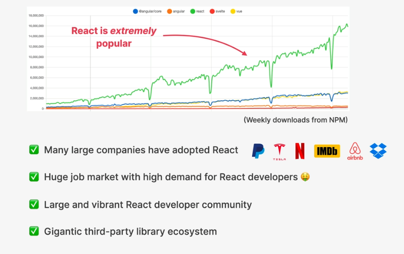

## What is React

### Based on Components
Components are the building blocks of user interfaces in React

### Declrative
We describe how components look like and how they are using a declrative syntax called JSX
Telling React what component should look like based on current data / state
React is abstraction away from DOM.We never touch the DOM

#### JSX 
A Syntax that combines HTML CSS Javascript as well as referencing  other components

### State Driven

## Javascript Library
React is only the view layer. We need to pick up multiple external libraries to build a complete application

## Extremely popular

## Summary
Rendering components on webpage based on their current state
Keeping the UI in sync with state, by re-rendering when state changes

