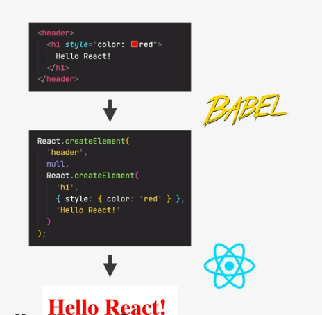
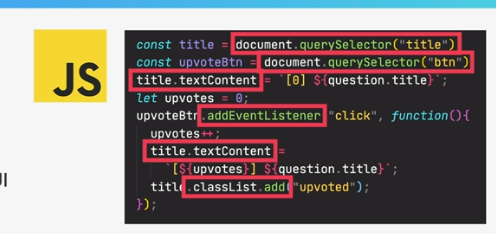
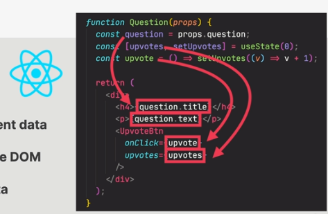
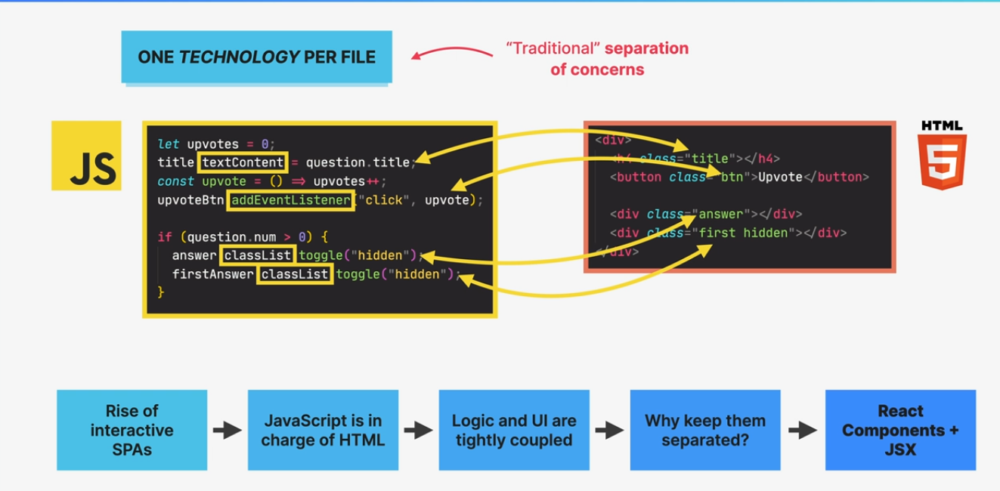
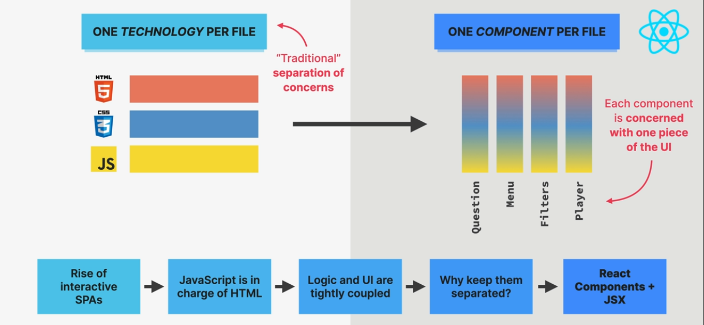

## Components as Building Blocks
React applications are entirely made out of components
Building blocks of user interfaces in React
Piece of UI that has its own data, logic and appearance.
We build complex UI  by building multiple components and combining them.
Components can be resused , nested ,inside each other and passed between them

Need to start with uppercase
Return a marker
Never nest component declarion

## What is JSX
Declarative syntax to describe what components look like and how they work

Components must return a JSX

Extenions of Javascript that allows us to embed Javascript CSS and React components into HTML

Babel does this transpilation which is included using create-react-app

### JSX is declarative

Imperative
Manual DOM Selection and DOM Traversing
Step by Step DOM mutations until we reach desired UI

Declarative
Describe what UI should look like using JSX, based on current data
React is an abstraction away from the DOM:we never touch the DOM
Instead , we think of the UI as a reflection of current data

## Seperation of Concerns
Logic and UI are tightly coupled

## Seperation of Component 
